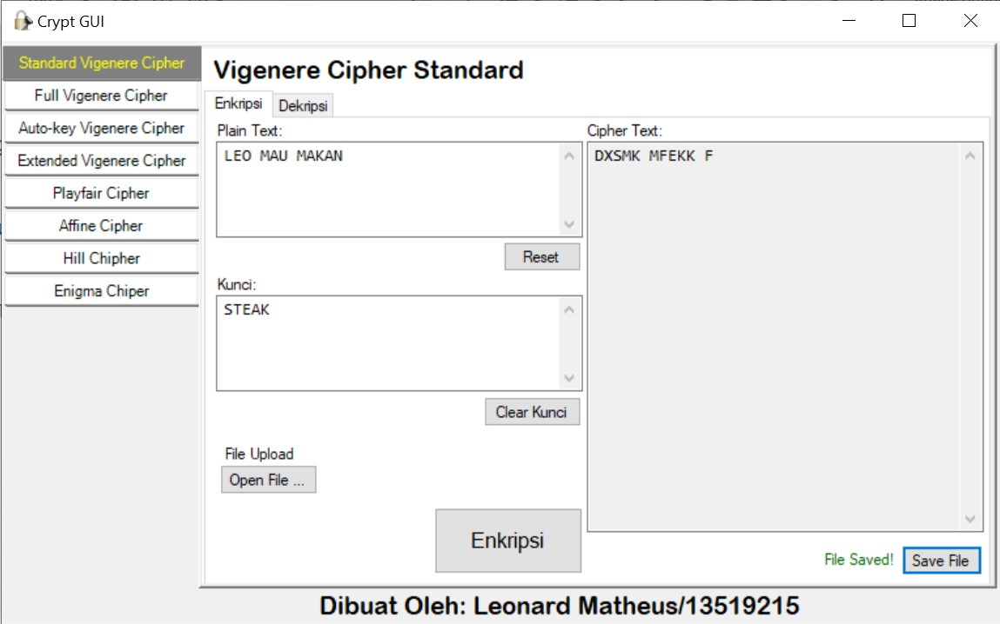

# Crypt_GUI


## Description
A program in C++ with an interface (GUI) that implements: 
- Vigenere Cipher standard
- Vigenere Cipher Variant
- Extended Vigenere
- Playfair Cipher
- Affine cipher 
- Hill cipher 
- Enigma cipher

## How to Install
1. Download this package
2. Open ```CryptGUI.msi```
3. Follow the instruction inside installer
4. Congratz!

## Dibuat oleh / Created by
Leonard Matheus / 13519215
